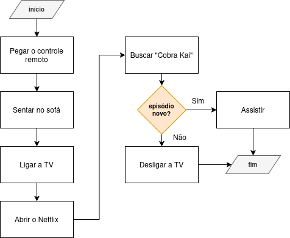

# 💻 Roteiro 2

## Exercício 1

Escolha uma atividade que você realiza na sua rotina e escreva um algoritmo para ela.

## Exercício 2

Desenhe um fluxograma para o algoritmo que você escreveu no exercício 1.

## Exercício 3 

Desenhe um fluxograma para o seguinte algoritmo:

**Algoritmo para escovar os dentes:**

1. Ir até a pia do banheiro;
2. Bochechar água;
3. Pegar a escova de dente;
4. Pegar a pasta de dente;
5. Colocar um pouco de pasta na escova;
6. Molhar a escova;
7. Escovar os dentes;
8. **Se os dentes ainda não estiverem limpos:** voltar ao passo 7;
9. **Senão:** ir ao passo 10;
10. Bochechar água;
11. Lavar a escova de dente;
12. Guardar a escova de dente;
13. Guardar a pasta de dente.

## Exercício 4 (desafio) 

Escreva o algoritmo que o fluxograma abaixo representa:

## 🔥 Exercício 5 (super desafio)

**Obs.: não é necessário resolver este exercício, pois ele contempla conceitos que nós ainda vamos estudar. No entanto, alunos que já têm experiência prévia na área de programação e/ou que tenham concluído os exercícios 1-4 com muita antecedência podem tentar resolvê-lo.**

1. Desenhe um fluxograma que represente o funcionamento do cofre digital do Gandalf, que funciona da seguinte forma: 

    * O usuário tem 3 tentativas para acertar uma senha;
    * Inicialmente, o cofre exibe a mensagem "Fale, amigo, e entre. Qual eh a senha correta? 3 tentativas restantes ate a autodestruicao...";
    * A senha correta é a string "Um anel para a todos governar";
    * Após cada tentativa incorreta, o cofre diminui o número de tentativas restantes e exibe a mensagem "A senha foi esquecida ate mesmo pelos sabios de Valfenda. Voce possui X tentativas restantes...", onde X é o número de tentativas restantes; 
    * Se o usuário acertar a senha, o cofre exibe "O caminho esta livre..." e abre;
    * Se o usuário errar 3 vezes, o cofre exibe "Voce nao passara!" e se autodestrói nas chamas de Mordor.

2. Em seguida, implemente um programa em Python que simula o comportamento do cofre digital do Gandalf, com base no fluxograma que você desenhou.
